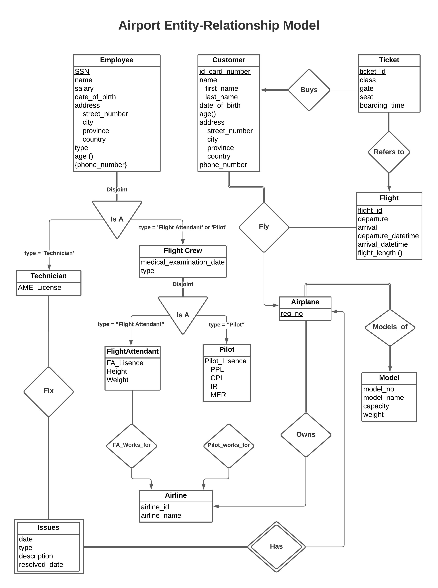
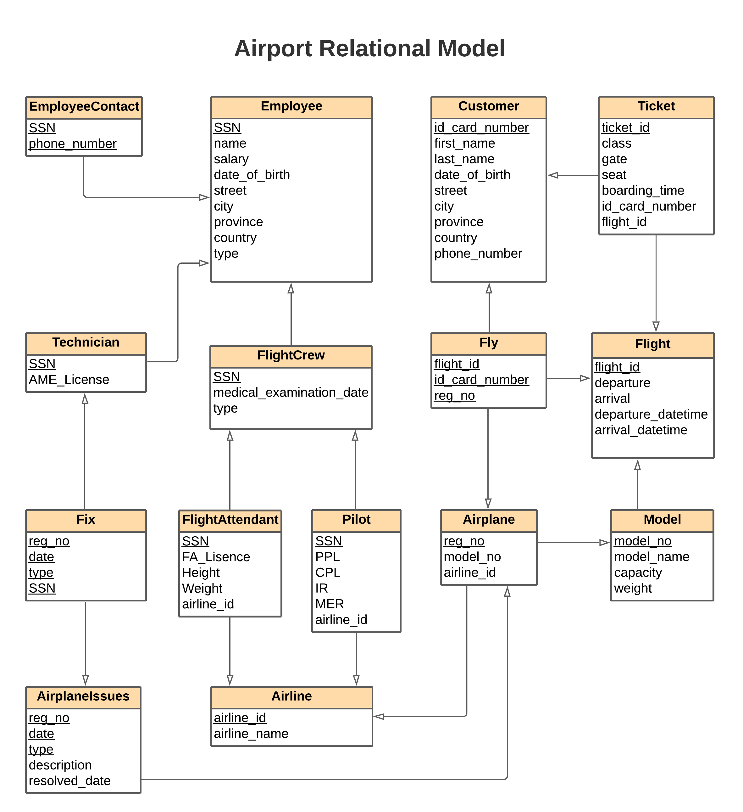

# Airport-Database-Design

An airport database design based on Soekarno-Hatta International Airport in Jakarta. Contains almost all aspects of an airport, such as pilots, tickets, employees, airlines, airplane models, etc.\

## How to use
Since this sql is created and tested using mariadb, you need to have mariadb on your computer to use it.
1. Download the `airport.sql` file from the repository or the zip from [here](https://github.com/bagasjiwanta/Airport-Database-Design/files/7792566/airport.zip) (extract if you download the zip file)
2. Open up mariadb in the folder containing the `airport.sql` file and create a database called `soetta`
```sql
create database soetta
```
3. import the sql file using this command
```sql
use soetta
\. airport.sql
```
4. To make sure things work, use this example command
```sql
select airline_name from airline where airline_id = 104;
```
make sure it returns a single airline_name which is `THAI LION AIR`. If done, then you can freely use the database.

## How we built it
The whole document can be accessed in the `docs` folder from Milestone1, 2, and 3.

### Milestone 1
First, we analyzed what would an airport need and built the entity relationship design
</img>

### Milestone 2
And then we made a relational design based on the entity relationship design. There are many ways to do this, but we choose it this way.
</img>

### Milestone 3
After getting approval from the task giver, we proceed to build the sql files. Our method was :
1. Making dummy data with help of https://www.mockaroo.com/
2. Manually adding data for the tables containing foreign key
3. Combine all the tables' sql
